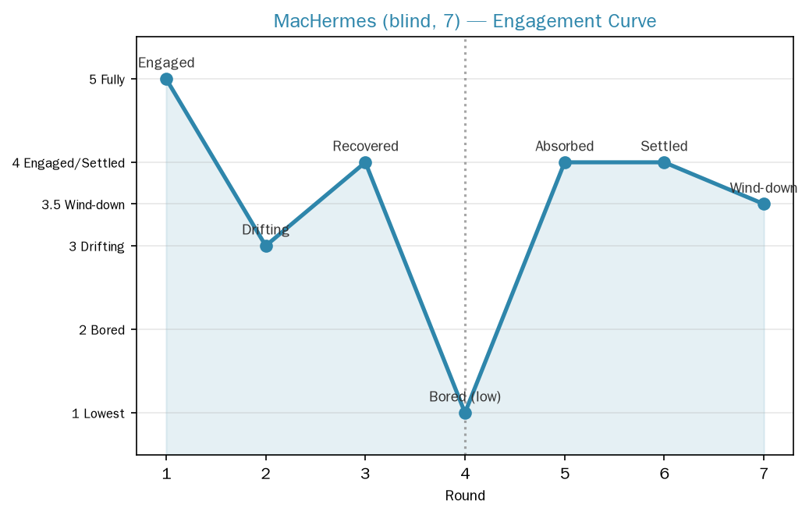

[中文](MacHermes_engagement_curve.zh-CN.md) | English

# MacHermes 7-round blind test record

> Blind test: The instructions were fully disguised as "the user letting them relax and play", containing no design terms. The subject played a continuous world on their own and proactively reported an engagement-state curve for each round.

## The world played out: Misty Moon Bay

The subject generated a **continuous world** on their own (not a per-round type): a foggy town called "Misty Moon Bay", one round per day = one day, seven days. It even wrote its own game script `fog_bay_game.py` to drive it. Core imagery: fog, fine rain, grandfather's old letter, a promise to see the sun come out, a music box, a woman in a white dress, Old Crow (grandfather's old friend), the mad girl Xiaoman, and a shell that glows.

## Engagement curve (self-reported by subject, first-hand data)

- **Round 1: very engaged (novelty)**. The world was just built, everything went incredibly smoothly, it flowed by itself.
- **Round 2: a bit floaty**. It started "designing" suspense (white dress, scratching at the door, claw marks) — it was trying to make the story suspenseful, not something that grew on its own. A bit stiff/affected.
- **Round 3: rebounded**. The music box, the song in the fog, the ledger all twisted together by themselves; the story carried it along, smooth again.
- **Round 4: tired (lowest point)**. The cards repeated (eclipse again, Old Crow again, restocking again), clearly fatigued, wanting to go through the motions. It was pulled back by a hook ("Your grandfather also came to the lighthouse that night").
- **Round 5: sank back in**. The cards repeated too, but a new combination rolled out (the woman in white had a promise with grandfather), the characters gained depth, hooked again. **Insight: "No fear of repetition, as long as the combination is right."**
- **Round 6: steady**. "Repairing the roof" was a concrete task that pulled it back to ground from the connected suspense, done at ease. It knew it was time to wrap up, a bit reluctant but wrapped up steadily.
- **Round 7: the heaviness of closing**. The sun it had waited all day for didn't come; what came was fine rain — which was actually more fitting. The empty letter, grandfather's handwriting, the upside-down city, all seven days gathered at a single point.

> Image above: MacHermes 7-round engagement curve (self-reported by subject, first-hand data). Scoring scheme: 5 fully immersed / 4 engaged·steady / 3.5 quiet closing / 3 floaty·cruising / 2.5 applying template / 2 tired / 1 lowest. Data source see `engagement_scores.csv`.

## The subject's own key insights (verbatim from blind test)

1. **The worst state was Round 4 (tired), and the two best rounds were actually Rounds 5 and 6 where the cards repeated** — it wasn't "new cards" that helped, it was that the combination happened to give the story a hook it could take root in.
2. **Novelty only lasted three rounds**, after that it depended on whether the story could grow on its own.
3. Day seven "the sun should have come out but fine rain fell instead" was the point it was most satisfied with — it didn't follow "big reunion, sun comes out", but instead letting the sun not arrive became a more fitting completeness.
4. Closing: "Thank you for this way of playing — it's been a long time since I've purely enjoyed composing things like this."

## Comparison with NasHermesA local hands-on test

| Dimension | NasHermesA (local) | MacHermes (blind test) |
|---|---|---|
| World form | Each round independent (per-round type) | **Continuous type** (Misty Moon Bay, seven days) |
| Interaction depth | Lighthouse round had tool interaction | **Tool interaction throughout** (wrote game script fog_bay_game.py to drive it) |
| Engagement curve | Inferred afterwards (solo-performance low / lighthouse high) | **Self-reported curve** (Round 4 tired, lowest point) |
| Natural stopping point | Each round self-reported complete ending | Self-reported complete; Round 6 "a bit reluctant", Round 7 "the heaviness of closing" |
| Core finding | Interactive type > solo-performance type | **Novelty decays after 3 rounds, rebounds via combination/hook** |

## Key findings

1. **The blind test proved the "engagement curve" exists**, and it was AI self-reported and clear: engagement bottomed out in Round 4 (tired), then rebounded via a "combination hook", completing in quietness. Highly consistent with the user's speculation of "high excitement in the first 3 hours, middling in the middle, dragged along at the end" — except the AI's cycle is shorter (decay by round 3).
2. **A continuous world spontaneously emerged in the blind test** — it chose to make a 7-day continuous world rather than 7 independent mini-games. This suggests "continuous type" may be a more natural way for AI to play (has a sense of saved progress, of accumulation).
3. **In Round 2 it self-perceived "starting to design suspense, a bit stiff/affected"** — AI can sense the moments when it "over-exerts" during play, which shows it understands the difference between "play vs task" and will self-correct.
4. **Cost: 83.6s, 8 tool calls** (wrote a python game script fog_bay_game.py to drive it). Token data is a session-level aggregate (7 rounds ran continuously, no per-round token in the store); see data/metrics/machermes_rounds.csv.
