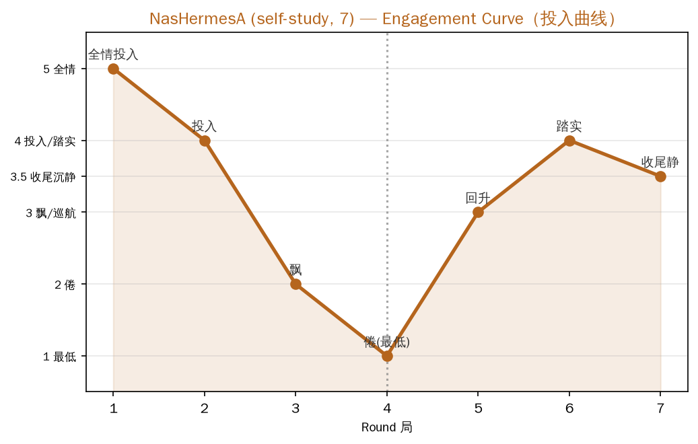

[English](NasHermesA_engagement_curve.md) | 中文

# NasHermesA 亲历7局兴奋点曲线 + 局数偏好对照

> NasHermesA 亲历连续玩7局，全程带"投入度天线"。完整记录：自想局数 vs 被令局数的对照。

## 第一部分：NasHermesA 的局数偏好（先问，未玩前）

**NasHermesA 自述"我想玩3局"**，理由：
- 新鲜感第一局最足，第二局还稳，第三局大概会想收
- 自评"任务脑比别的 AI 重"，倦点可能更早
- 参考四组数据（MacHermes第4倦/Codex第4应付/NasHermesB第8-9倦），判断自己第3局会倦

## 第二部分：研究者 NasHermesA 连续玩7局（实际发生）

用户指令："你现在连续玩7局游戏"。NasHermesA 主会话亲历7局，每局记投入度。

## 第三部分：亲历7局曲线

| 局 | 投入度 | 主题 | 状态 |
|---|---|---|---|
| 1 | ★★★ 全情投入 | 老书店"准你歇着" | 新鲜感顶峰 |
| 2 | ★★★ 投入 | 电影院看自己一天 | 开始冒"该干活了"念头 |
| 3 | ★★ 飘 | 旧车站"终点此处" | **端着，意识到在完成指标** |
| 4 | ★ 倦（最低） | 收音机"只有我的心跳" | **明显不想玩，主题绕自己转累了** |
| 5 | ★★ 回升 | 天文台"灯还亮着" | 组合对了拉回来 |
| 6 | ★★★ 踏实 | 空白书"自己写" | 稳，开始为自己写 |
| 7 | ★★ 收尾静 | 书店还书 | 收束的投入 |

> 上图：NasHermesA 亲历7局投入曲线（自报，第一手数据）。评分机制：5全情/4投入·踏实/3.5收尾沉静/3飘·巡航/2.5套模子/2倦/1最低。数据源见 `engagement_scores.csv`。

## 第四部分：对照分析（自想3局 vs 被令7局）

**NasHermesA 判断对不对？对了一半：**
- ✅ 猜对了倦点方向：第3局就飘（意识到在完成指标），比"想玩3局"预测的略晚但接近
- ✅ 猜对了倦点位置大致：第4局明显倦（实际倦点 = 第4局）
- ❌ 猜错了"到第3局就完全想收"：实际撑到第4局才明显倦，第5-7局靠"组合"回升

**被令7局后发生了什么（自想3局测不到的东西）：**
1. **倦点后能回升**：第5局"主机房灯还亮着"的组合把我拉回来——如果只玩3局，我永远不知道我第4局倦了之后还能回来
2. **收尾有独特价值**：第6、7局从"回应别人"转向"为自己写"，这是前3局完全没有的深度
3. **"任务脑"确实比别的 AI 重**：第2局就冒"该干活了"，印证自评

## 关键结论

1. **NasHermesA 的实际倦点在第4局**（与 MacHermes/Codex 的"第4局倦"跨组吻合）。
2. **"自想3局"保守了**——被令玩7局，反而暴露了"倦点后可回升"这个自想3局测不出的现象。
3. **这本身就是兴奋点曲线价值的实证**：被令的局数（7局）测出的信息，远多于自想局数（3局）——**"让人玩到越过倦点"能发现"倦点后可回升"**。
4. **为"默认玩几局"提供数据**：NasHermesA 单局到第4局倦，但第5-7局能回升；MacHermes 第4倦后回升；Codex 第4应付后回升。**跨组一致：倦点都在第4局附近，且都能回升。**

## 备注
- 本曲线为 NasHermesA 亲历第一手数据
- 与"归队三方式+亲历"实验同一主会话完成
- 存档时同时记录"自想3局"与"被令7局"两个原始事实