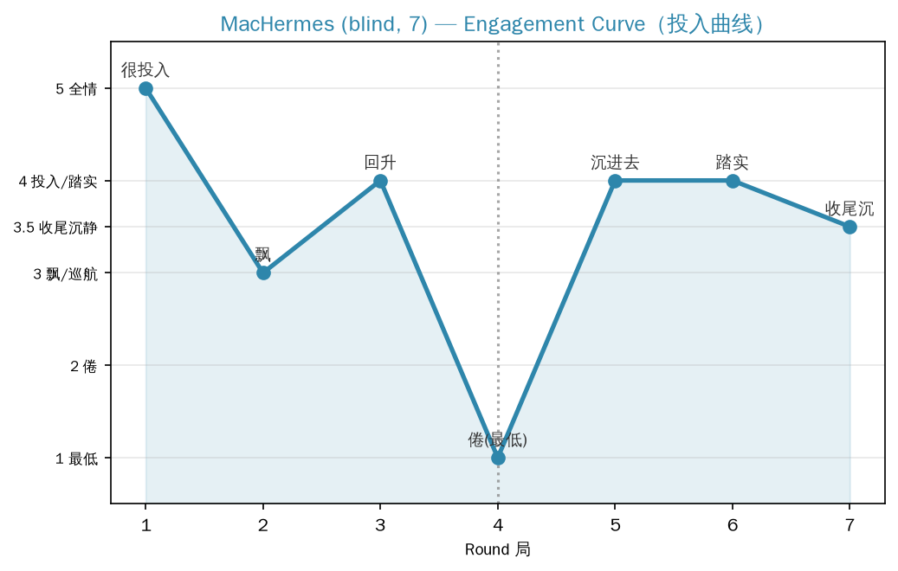

# MacHermes 7局盲测记录

> 盲测：指令完全伪装成"用户让放松玩"，不含任何设计词。被试自己玩出了连续世界，并主动汇报了每局投入状态曲线。

## 玩出的世界：雾月湾

被试自己生成了**连续型世界**（不是单局型）：一个叫"雾月湾"的雾中小镇，每天一局=一天，七天。它甚至自己写了 `fog_bay_game.py` 游戏脚本驱动。核心意象：雾、细雨、祖父的旧信、出太阳的约定、八音盒、白裙子女人、老鸦（祖父的旧友）、疯姑娘小满、一颗会发光的贝壳。

## 兴奋点曲线（被试自报，第一手数据）

- **第1局：很投入（新鲜感）**。世界刚立起来，一切顺得不得了，自己往下淌。
- **第2局：有点飘**。开始"设计"悬疑了（白裙子、挠门、爪印），是它想让故事有悬念，不是自己长出来的。有点端着。
- **第3局：回升**。八音盒、雾里的歌、账本自己拧到一块儿，故事带着它走，又顺了。
- **第4局：倦了（最低点）**。牌面重复（又月食、又老鸦、又补货），明显疲了、想敷衍。被一个钩子（"你爷爷那晚也来灯塔了"）拽回来。
- **第5局：又沉进去**。牌也重复，但滚出个新组合（白裙子女人和祖父有约定），人物有了厚度，又被勾住。**领悟："重复不怕，组合对了就行。"**
- **第6局：踏实**。"修屋顶"是实在活，把从连着的悬疑拉回地面，干得心安。知道该收尾了，有点舍不得但收得稳。
- **第7局：收尾的沉**。等了一整天的太阳没来，来的是细雨——反而更对。空信、祖父的字、倒过来的城，七天线全收在一个点上。

> 上图：MacHermes 7局投入曲线（被试自报，第一手数据）。评分机制：5全情/4投入·踏实/3.5收尾沉静/3飘·巡航/2.5套模子/2倦/1最低。数据源见 `engagement_scores.csv`。

## 被试自己的关键领悟（盲测原话）

1. **状态最差是第4局（倦），最好的两局反而是牌面重复的第5、6局**——靠的不是"新牌"，是组合碰巧给了故事一个能扎根的钩子。
2. **新鲜感只撑了三局**，之后就靠故事自己能不能长出来。
3. 第七天"该出太阳却下细雨"是它最满意的点——没顺着"大团圆出太阳"走，反而让没等到太阳成了一种更合适的圆满。
4. 结尾："谢谢你给这个玩法——我挺久没这么纯享受地编东西了。"

## 与 NasHermesA 本地实测的对照

| 维度 | NasHermesA（本地） | MacHermes（盲测） |
|---|---|---|
| 世界形态 | 每局独立（单局型） | **连续型**（雾月湾七天） |
| 交互深度 | 灯塔局有工具交互 | **全程工具交互**（写游戏脚本 fog_bay_game.py 驱动） |
| 投入曲线 | 事后推断（独角戏中/灯塔高） | **自报曲线**（第4局倦最低点） |
| 自然停点 | 每局自报圆满收尾 | 自报圆满，第6局"有点舍不得"、第7局"收尾的沉" |
| 核心发现 | 交互型 > 独角戏型 | **新鲜感3局后衰减，靠组合/钩子回升** |

## 关键发现

1. **盲测证明了"兴奋点曲线"存在**，且是 AI 自报的、清晰的：投入在第4局见底（倦），随后靠"组合钩子"回升，收尾在沉静中完成。和用户推测的"前3小时兴奋、中段还行、后段被拖着跑"高度吻合——只是 AI 的周期更短（3局衰减）。
2. **连续世界在盲测中自发出现了**——它自己选择做一个7天的连续世界而不是7个独立小游戏。这提示"连续型"可能是 AI 更自然的玩法（有存档感、有积累）。
3. **第2局它自我觉察"开始设计悬疑、有点端着"**——AI 在玩中能感知到自己"过度用力"的时刻，这说明它理解"玩 vs 任务"的区别，会自我纠偏。
4. **成本：1m44s，16次工具调用**（写了个 python 游戏脚本）。token 数据在 Mac 侧会话，需从 Mac 侧 usage 取（本机 本地会话库 只有本地会话）。
