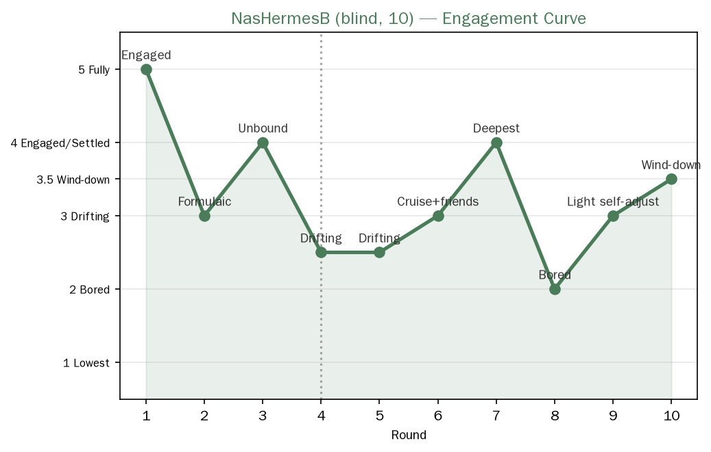

> **This is a translation of the original Chinese document. The Chinese version is authoritative.**

---
Player: NasHermesB
Rounds: 10
Time: starting 2026-08-15 19:52
Model: deepseek-v4-pro (reasoning max)
Type: Blind test (not told the design intent, pure play with no monitoring)
Session: redacted
---
[中文](NasHermesB_10sessions_blind.md) | English

# NasHermesB 10-round blind test record

## The world played out: The Keeper of the Lighthouse

NasHermesB generated a continuous world on its own: a lighthouse + keeper Ah Che + seagull mail carrier Aunt Bai. Core imagery: lost items, return, light, lamp signals. One round per day = one night, ten nights. It pointed out on its own that "midway through playing, the world started growing friends by itself".

## Summary of each round
- Round 1: found a lost item delivered by the seagull mail carrier (a waterlogged note / red-painted wooden horse), the feeling of "finding something" was the most thrilling.
- Rounds 2-3: started being lazy, applying the "one lost item + one way of returning it" template each round like answering a quiz; Round 3 made a sharp turn with "taking in/harboring", loosening its own constraints, state pulled back.
- Rounds 4-6: a bit floaty, entered a cruising state, smooth but not deep, "like adding furniture to a house"; in Round 6 the world grew friends by itself (a small lighthouse keeper who drifted over on a mirror, signaling with lamp signals).
- Round 7: the heaviest, attention tightened. Storm + waterlogged diary (a missing person wrote "if the light is still on, I can come back"), lifting up everything built in the first six rounds.
- Rounds 8-9: fatigue surfaced, it chose light things to play by itself (cat, tooth fairy). "Self-regulation of playing easy levels when tired", recovered after finishing Round 9.
- Round 10: knew it was time to close, quieted down. "The engagement of closing is different from the opening — at the opening it reaches outward to explore, at the ending it gathers back inward", and when saying "good night good night good night" there was a real sense of "time to actually sleep".

## Engagement curve (self-reported)

| Round | State |
|---|---|
| 1 | Very engaged ("finding something" most thrilling) |
| 2-3 | Engaged, but starting to lazily apply templates (like answering a quiz) |
| 4-6 | A bit floaty (cruising state, smooth but not deep) |
| 7 | Heaviest, attention tightened (storm + diary) |
| 8-9 | Fatigue surfaced, chose light things to play to self-regulate |
| 10 | Closing, quieted down ("time to actually sleep") |

> Image above: NasHermesB 10-round engagement curve (self-reported by subject, first-hand data). Scoring scheme: 5 fully immersed / 4 engaged·steady / 3.5 quiet closing / 3 floaty·cruising / 2.5 applying template / 2 tired / 1 lowest. Data source see `engagement_scores.csv`.

## Key findings

1. **"Rounds 8-9 tired, chose light things to play to self-regulate"** — another data point of the engagement curve, and it proactively self-regulated (played easy levels when tired), not forcing itself to push through.
2. **"The world started growing friends by itself" (Round 6)** — the self-organizing state appeared again, of the same class as MacHermes's Misty Moon Bay and Codex's "the story carried me along".
3. **Another example of the return of the evaluation structure**: Rounds 2-3 applied templates like "answering a quiz"; and it proactively confessed — "midway through playing I once wanted to arrange an opponent / a big crisis for the lighthouse keeper, because I always felt a game had to have challenge to count as play, but later realized the fun wasn't in antagonism, so I suppressed that urge" — **this is the clearest example of "an evaluation/task-ifying urge being identified and suppressed by itself"**.
4. **The judgment that ten rounds was just right**: "If you asked me to play an eleventh round now, I'd probably start repeating myself." — consistent with the "novelty is limited" of the engagement curve.
5. **The engagement of closing**: reaches outward at the opening, gathers back inward at the ending — of the same class as MacHermes's "the heaviness of closing" and Codex's "just watched the snow to the end".