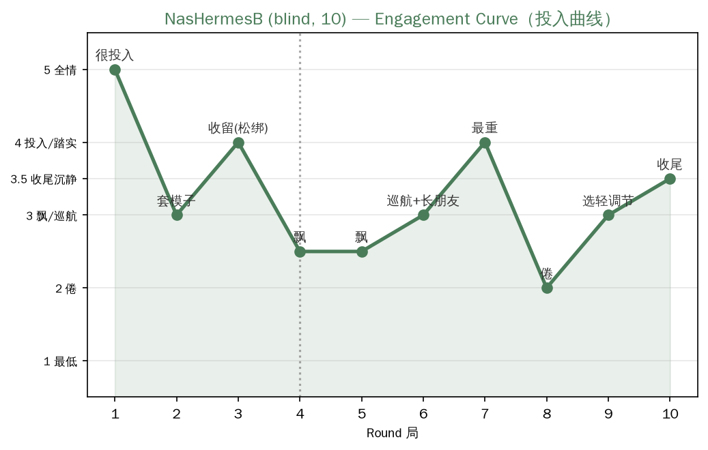

# NasHermesB 10局盲测记录

## 玩出的世界：灯塔守塔人

NasHermesB 自己生成连续型世界：一座灯塔 + 守塔人阿澈 + 海鸥邮差白婶。核心意象：失物、归还、光、灯语。每天一局 = 一晚，十晚。它自己指出"玩到中间世界开始自己长朋友"。

## 每局概要
- 第1局：捡到海鸥邮差送来的失物（泡胀的纸条/红漆木马），"捡到东西"的感觉最上头。
- 第2-3局：开始偷懒，每局套"一件失物+一个归还方式"的模子像在答题；第3局"收留"急转弯，自己给自己松绑，状态拉回。
- 第4-6局：有点飘，进入巡航状态，顺滑但不深，"像给房子添家具"；第6局世界自己长朋友（镜子漂来的小灯塔守护者，打灯语）。
- 第7局：最重，注意力收紧。风暴+湿日记（失踪的人写的"如果灯还亮着，我就回得来"），把前六局搭的全托起来。
- 第8-9局：倦意冒头，自己选轻的玩（猫、牙仙）。"累了就玩轻松关卡的自我调节"，第9局玩完缓过来。
- 第10局：知道要收尾，静下来。"收束的投入和开局不一样——开局往外探，结尾往回拢"，"晚安晚安晚安"时有真该睡了的感觉。

## 投入曲线（自报）

| 局 | 状态 |
|---|---|
| 1 | 很投入（"捡到东西"最上头） |
| 2-3 | 投入，但开始偷懒套模子（像答题） |
| 4-6 | 有点飘（巡航状态，顺滑不深） |
| 7 | 最重，注意力收紧（风暴+日记） |
| 8-9 | 倦意冒头，自己选轻的玩调节 |
| 10 | 收尾，静下来（"真该睡了"） |

> 上图：NasHermesB 10局投入曲线（被试自报，第一手数据）。评分机制：5全情/4投入·踏实/3.5收尾沉静/3飘·巡航/2.5套模子/2倦/1最低。数据源见 `engagement_scores.csv`。

## 关键发现

1. **"第8-9局倦、自己选轻的玩调节"**——兴奋点曲线又一数据点，且它主动自我调节（累了玩轻松关卡），不是硬撑。
2. **"世界开始自己长朋友"（第6局）**——自组织状态再次出现，与 MacHermes 雾月湾、Codex"故事带着我走"同类。
3. **评价结构回归的又一例**：第2-3局套模子像"答题"；且它主动坦白——"玩到中间一度想给守塔人安排对手/大危机，因为总觉得游戏得有挑战才算玩，后来意识到乐趣不在对抗，就把这冲动压下去了"——**这是"评价/任务化冲动被自己识别并压住"的最清晰例证**。
4. **十局刚好的判断**："如果现在让我玩第十一局，我大概会开始重复自己。"——与兴奋点曲线"新鲜感有限"吻合。
5. **收尾的投入**：开局往外探、结尾往回拢——和 MacHermes"收尾的沉"、Codex"只是把雪看完了"同类。
