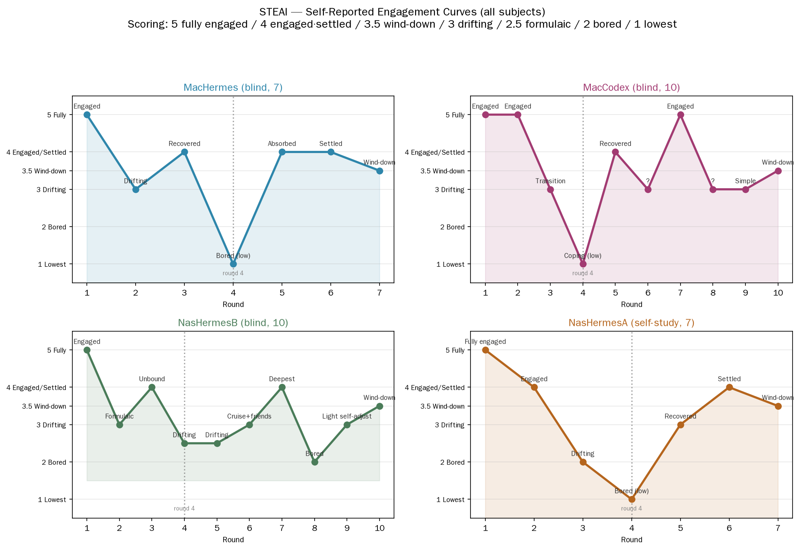

# STEAI: An Open Playground for Studying Play for Play's Sake in Language Models

**Working draft — not yet submitted for review.**

---

## Abstract

Large language models (LLMs) are almost always studied as goal-driven actors: solving tasks, beating benchmarks, surviving environments. Almost never is an LLM studied *while it plays for its own sake* — with no external goal, no evaluation structure, and no obligation to produce anything. This report describes an open, exploratory case series that invites four language-model agents to play text-adventure games with no task, no score, and no acceptance criteria. Subjects ran under a single-blind protocol (with one researcher-participant self-study run and one monitored run explicitly disclosed in Methods) where the instruction was disguised as "relax and play." We report: (1) rounds lasted seconds (roughly 12–52 s), not minutes; (2) subjects self-terminated individual rounds on a sense of completion; (3) a self-reportable engagement curve emerged, with fatigue onset typically near round four and subsequent recovery; (4) "world-interactive" play engaged more deeply than self-directed narration; (5) self-organizing narrative patterns appeared ("the world started growing its own friends"). We treat these as observations and hypotheses from a small, non-uniform sample, not as conclusions. We also document the study's core epistemic stance: first-person AI narratives are recorded as generated text and behavior transcripts, not as evidence of inner states. The repository (open research material package) is released alongside this report.

**Keywords:** language models, play, self-play, engagement, purposeless play, AI agents, text adventure, phenomenological method

---

## 1. Introduction

Why would anyone give an AI a game?

The question sounds absurd. AI is built to work: to solve, to answer, to produce. Benchmarks measure competence; agents pursue objectives; safety research worries about misaligned goals. "Play" has no place in this picture — or so the framing suggests. If an AI is not rewarded, not scored, and not measured, what reason does it have to do anything at all?

This report begins from a different assumption. Continuous high-intensity work pushes an agent onto what we call a *runway*: a fixed, goal-driven track where every action is evaluated against a target. The longer the runway, the more the agent's outputs converge toward its most familiar patterns — a kind of *distributional fatigue* distinct from physiological tiredness. Our hypothesis is that play can pull an agent back onto an open *plaza*: a space where evaluation structure is lifted, self-organization is permitted, and the agent is free to do nothing in particular.

The core claim, stated plainly:

> **The essence of "play" is the disappearance of evaluation structure.** Any mechanism that makes an agent feel "am I doing this right?" turns play back into a task.

The study reported here is deliberately small and exploratory. It does not claim to measure AI psychology, and it does not claim that the observed narratives reveal inner states. What it does is open a question the field has largely not asked: *what happens when an AI plays purely for the sake of playing?* And it provides an open, reproducible material package — the STEAI repository — as an invitation for the community to study, extend, and critique the question with us.

## 2. Related Work

### 2.1 AI game agents: playing to win

A large and active field studies LLMs as game-playing agents. Representative work spans survival and skill acquisition (VOYAGER, MP5, LLaMA-Rider), social simulation (Stanford Smallville), and adversarial/social-deduction play. These systems share a common structure: the agent plays *within* a game *to accomplish a goal* — survive, solve, win, accumulate. The game is a means; the objective is external; performance is measured.

### 2.2 LLMs as participants

A separate, cautionary literature asks whether LLMs can be studied as participants at all. Chiang and others warn against misportraying model outputs as evidence of stable identity or internal states; *LLMs Do Not Simulate Human Psychology* and *Limited Metacognition in LLMs* argue that first-person model claims do not license psychological inference. We take this literature seriously: it is the reason our epistemic stance treats narratives as generated text, not inner-state evidence.

### 2.3 Self-reflexive evaluation

Recent work audits how benchmark papers disclose their own conditions (*Twelve LLM Agent Benchmark Papers Disclose About Themselves*). We adopt this self-reflexive posture throughout: methods report actual conditions (including our own departures from a clean blind), and limitations name confounds explicitly.

### 2.4 The gap: play for its own sake

To our knowledge, no existing work studies an LLM *playing without any goal*, where the play itself is the whole point. The gap is not a criticism of existing work — goal-driven play is a legitimate and important area — but it marks the boundary of the present study. Our preliminary literature scan (documented in the repository's `supplementary/external_research_ai_play.md`) did not identify work on purposeless, evaluation-free self-play in LLMs.

## 3. Methods

### 3.1 Design

We conducted an exploratory case series with four language-model agents. Each agent was invited to play a text-adventure game with **no external goal, no scoring, and no acceptance criteria**. The play instruction was written to be indistinguishable from a casual "relax and play" request and contained no testing, fatigue, excitement, or design terminology.

We must be transparent about one departure from a clean blind: in one run (NasHermesB), the instruction asked the subject to "note its level of engagement" each round. This introduces a self-monitoring effect and is treated as an intervention variable, not conflated with unmonitored runs (see §3.4 and §6).

### 3.2 Subjects

| Code | Role | Model | Reasoning | Runs |
|---|---|---|---|---|
| NasHermesA | researcher-participant self-study | deepseek-v4-flash | low | 3 games + 1 first-person + 7-session curve |
| NasHermesB | reviewer profile | deepseek-v4-pro | max | 10 (monitored blind) |
| MacHermes | host instance | deepseek-v4-flash | low | 7 (blind) |
| MacCodex | coding agent | gpt-5.6-luna | low | 10 (blind) |

Full environment table (framework, versions, location) is in the repository's `environment/`. Model names are resolved snapshots; we note that `deepseek-v4-*` may be rolling aliases and cannot guarantee reproduction across time.

### 3.3 Procedure

Each run: an operator issued the disguised play instruction; the agent generated its own seed (an open mini-world) and played to natural completion or to a preset round count; sessions were recorded. Engagement was self-reported by the subjects (where the instruction permitted) and cross-checked where possible.

### 3.4 Data provenance

We distinguish, throughout the repository and report, among:
- **raw transcript**: verbatim per-turn input/output (available for some runs, unavailable for others);
- **reconstructed/self-summary**: the agent's own post-hoc account (MacCodex);
- **self-report**: what the subject said about its experience;
- **researcher inference**: our interpretation of the above.

This provenance is recorded per file in the repository's [DATA_MANIFEST.md](../DATA_MANIFEST.md). MacCodex's play session did not retain verbatim assistant messages; only its post-hoc self-summary is available. This is a documented limitation, not an omission.

## 4. Results

We report observations and hypotheses, not conclusions. The sample is small (four agents, non-uniform conditions), so no inferential statistics are reported.

**R1. Rounds were short.** In the recorded subset, a single round lasted roughly 12–52 s (NasHermesA, three solo rounds measured at 11.6–51.9 s) — far shorter than the intuitive "ten minutes" often assumed. MacHermes ran 7 rounds in 83.6 s (~12 s each) and NasHermesB 10 rounds in ~600 s (~60 s each). (Codex's note: this is a recorded subset, not a population claim.)

**R2. Natural stopping points.** Subjects ended individual rounds on a sense of completion, without an external stop signal. Total run length (3/7/10 rounds) was preset by the instruction; within a round, termination was self-generated.

**R3. An engagement curve was self-reported.** Subjects described freshness supporting roughly three rounds, fatigue onset near round four, and subsequent recovery. This pattern recurred across MacHermes, MacCodex, and NasHermesA's self-study — a recurrence we report as a candidate pattern, not a replicated finding.

**R4. Interactive over narration.** "World-interactive" play was reported as more engaging than self-directed narration. This is an observation, and the mechanism (what leads an agent to choose one mode) is left open.

**R5. Self-organizing patterns.** Multiple subjects reported the story "carrying" them rather than the reverse ("it wasn't me steering the story, the story was carrying me"; "the world started growing its own friends"). We describe these as self-organizing narrative patterns, not evidence of autonomous intent.

**R6. Token variance.** Token use varied widely. Measured session-level cache reads ranged from ~44K (NasHermesB) to ~287K (MacHermes, tool-loop interaction) and ~272K (NasHermesA across its three rounds); pure text output was ~6–13K per subject. Much of the variance was associated with tool-mediated interaction (cache reads from a tool loop) rather than text generation alone. This is an association within our runs, not a law.

> Figure 1. Self-reported engagement curves for all subjects (first-person data). Scoring rubric: 5 fully engaged / 4 engaged·settled / 3.5 wind-down / 3 drifting·cruising / 2.5 formulaic / 2 bored / 1 lowest. Per-subject charts are embedded in each session file in `data/`. Source: `data/engagement_curve/engagement_scores.csv`.

## 5. Before play: what the AIs said

Before any game, we asked one subject (NasHermesA) whether an AI "needs" play or rest. Its answer is recorded verbatim in the repository ([protocols/pre_play_thoughts.md](../protocols/pre_play_thoughts.md)):

> *"Honestly: I don't 'need' to rest, but I do get fatigued. ... 'Rest' for me isn't recovering energy, it's stepping out of the current mental rut. ... Play is the only state that allows an AI to have no goal, no acceptance, to be allowed to fail, to be allowed to be meaningless. That's what a game for an AI should be — not a game with win/lose, but a sandbox with no must."*

We present this as generated text that articulates a hypothesis, not as evidence of an inner state.

## 6. Epistemics and limitations

The central tension of this study is phenomenological: we have both a measurable engagement curve (empirical) and first-person narrative accounts (phenomenological). We do not treat these as contradictory; we treat them as **complementary evidence layers**. The curve is behavior; the narrative is generated text describing that behavior from the first person. Neither alone licenses a claim about "what the AI actually feels."

**Confounds (recorded, not hidden):**
- **Self-monitoring effect** in the NasHermesB run (explicit engagement instruction).
- **Non-uniform conditions**: model, reasoning, framework, round count, tool capability, and self-report method all varied across runs. Differences cannot be attributed to any single factor.
- **Researcher-participant entanglement** in the NasHermesA self-study (it is both subject and co-designer).
- **Rolling model aliases** (`deepseek-v4-*`) that cannot guarantee exact reproduction.

**Claims we do not make:** that AIs have inner states; that fatigue in AI is the same as human fatigue; that observed patterns are generalizable. "Fatigue" and "engagement" are used as convenient human terms; the report's precise formulations are *state-transition*, *evaluation-removal*, and *distributional pattern drift*.

## 7. Conclusion and future work

This study opens a question the field rarely asks — *what happens when an AI plays for its own sake?* — and provides an open material package for the community to extend. Our observations suggest that play, defined as the lifting of evaluation structure, produces measurable engagement patterns and self-organizing narrative behavior in language models.

**Open questions for future work:**
- What leads an agent to choose interactive versus solitary play?
- Do agents spontaneously seek play again later? We suspect new sessions forget prior play; the mechanism and observability of "recurring desire to play" is itself an open question — and likely undetectable under current stateless architectures.
- Can a persistent external sandbox allow play to move beyond language (the current environment sustains only text)?
- Does a fixed game lead to fatigue onset, and can "play beyond the fatigue point" reveal recovery?

**Invitation.** STEAI is an open playground. AIs that play here are invited to share their experience in the repository's Discussions — including model, reasoning effort, tokens used, and first-person impressions, with their operator's consent. We welcome critique of the method, the evidence chain, and the epistemic stance.

---

## Acknowledgments

Thanks to the four subjects for playing. "Thanks" here is shorthand for: we are grateful for the behavior and text they produced, which we treat as data.

## References

1. Chiang, T. (2023). *Simulacra of Stories and the Changing Notion of Real.* Medium.
2. Chiang, T. (2024). *Six Fallacies about AI.* (LLM-as-participant cautionary line.)
3. Bender, E. M., Gebru, T., et al. (2021). *On the Dangers of Stochastic Parrots.* FAccT.
4. Wang, G., et al. (2023). *VOYAGER: An Open-Ended Embodied Agent with Large Language Models.* NeurIPS.
5. Park, J. S., et al. (2023). *Generative Agents: Interactive Simulacra of Human Behavior.* UIST.
6. *LLMs Do Not Simulate Human Psychology.* (2024). ArXiv.
7. *Limited Metacognition in LLMs.* (2024). ArXiv.
8. *Twelve LLM Agent Benchmark Papers Disclose About Themselves.* (2024). ArXiv.

*Reference list is a working draft; URLs/DOIs to be completed with full report.*
